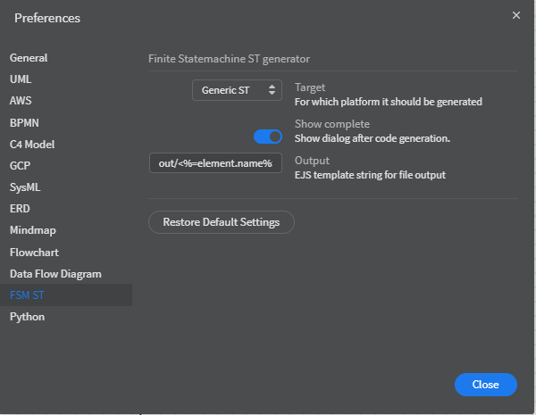
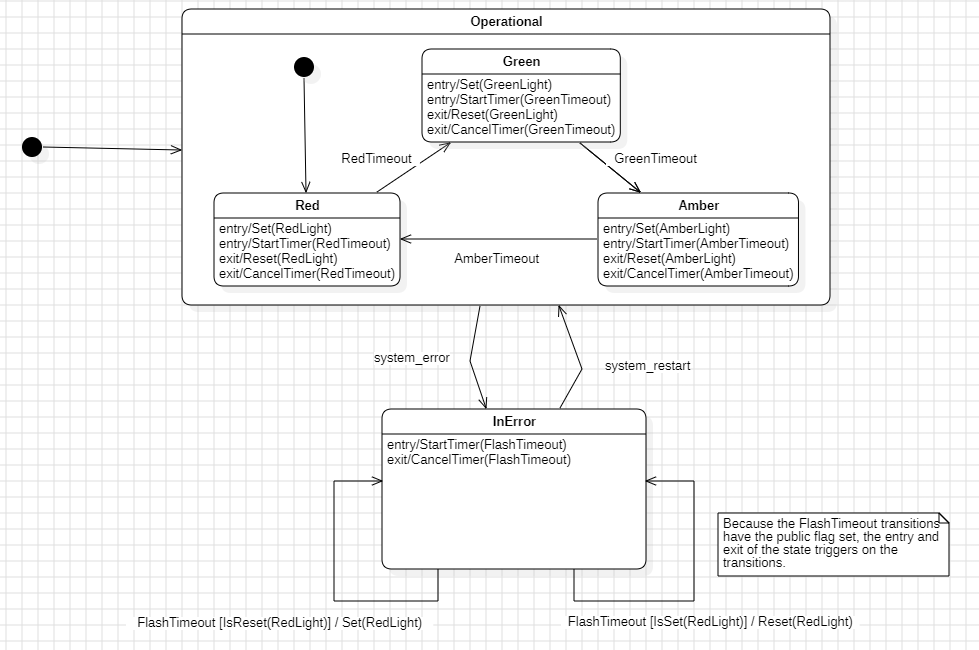

StarUML extension AWETA FSMST  <!-- omit in toc -->
====

- [1. Introduction](#1-introduction)
- [2. Installation](#2-installation)
- [3. Features](#3-features)
- [4. Supported StarUML statemachine elements](#4-supported-staruml-statemachine-elements)
- [5. Symbol use in the Statemachine diagram](#5-symbol-use-in-the-statemachine-diagram)
  - [5.1. Set( _name_ )](#51-set-name-)
  - [5.2. Reset( _name_ )](#52-reset-name-)
  - [5.3. IsSet( _name_ )](#53-isset-name-)
  - [5.4. IsReset( _name_ )](#54-isreset-name-)
  - [5.5. Put( _name_, _value_ )](#55-put-name-value-)
  - [5.6. Get( _name_ )](#56-get-name-)
  - [5.7. LGet( _name_ )](#57-lget-name-)
  - [5.8. Test( _name_ )](#58-test-name-)
  - [5.9. StartTimer( _name_, _timeout_ )](#59-starttimer-name-timeout-)
  - [5.10. CancelTimer( _name_ )](#510-canceltimer-name-)
- [6. Command-line](#6-command-line)
- [7. Implementation of the StateMachine with structured text](#7-implementation-of-the-statemachine-with-structured-text)
- [8. Example](#8-example)


# 1. Introduction

FSMST is an [StarUML](https://staruml.io/) extension that generates IEC 61131-3 Structered Text of a StarUML StateMachine diagram.
The generated output is Finite-state machine in the form of a `Function Block`.

The generated statemachine is intended to be used as is, please don't make changes to the generated code! This makes it possible to update your statemachine and easy redeploy the updated Function Block.

# 2. Installation
The extension is tested with StarUML version 6.1.1.
Follow the StarUML [guideline](https://docs.staruml.io/user-guide/managing-extensions#install-extension) for installing extensions.
When installing from url you can use https://github.com/awetagp/staruml-aweta-fsmst.


# 3. Features


* Extension for StarUML:
  * From the GUI (Tools Menu or key combination CTRL+W)
  * As from the command-line (documenation below)
* Validator for StateMachines (are the FSMs generatable)
* Generate a finite-state machine in structured text based on StarUML statemachine diagram, no full UML model required. Each statemachine diagram is standalone.
* Support for both composite and parallel (join and fork) substatemachines.
* Restore history for composite statemachines.
* Special methods available to use in effects and activities:
  * Start/Stop timers
  * Set and Reset bool
  * Put and get numbers
  * Test is bool is set and reset
  * By using the special functions in the statemachine, variable for the function block are automaticly extracted.
* A state name only has to be unqiue with in single UMLRegion (Each composite statemachine contains itw own regions).
* Direct support for timers
* For testing purpose; Input to reset entire statemachine.
* Current supported targets:
  * Generic ST - one big strucutred text file is generated
  * B&R ST - output is split in tree;  .type .fun, and .st
  * Siemens SCL - Slightly adapt to the differences between ST and SCL




# 4. Supported StarUML statemachine elements

* Basic:
  * Simple State
  * Initial State
  * Final State
  * Choice
  * Transition
  * Self Transition
* Advanced:
  * Composite State with multiple regions (parallel substatemachines)
  * Join
  * Fork
  * Shallow History

When from a self transition the property `kind` is set to `internal`, the entry and exit activities are not triggered.

*Be very carefull that the in StartUML not only the diagram matches the hierarchy but also in the model tree.
It is very easy to make a mistake with Composite state!*


# 5. Symbol use in the Statemachine diagram

General:
* Event Triggers are always `BOOl` inputs.<br/>
* As state guard can be `BOOL` or `DINT`.
* For inputs/outputs can be  `BOOL` and `DINT`.
When a symbol is used both as input and output an in/out var is created.


To generate the proper events, inputs and outputs the a strict naming convention must be used is the guard conditions and actions:


* Set( _name_ )
* Reset( _name_ )
* IsSet( _name_ )
* IsReset( _name_ )
* Put( _name_, _value_ )
* Get( _name_ )
* LGet( _name_ )
* Test( _name_ )
* StartTimer( _name_, _timeout_ )
* CancelTimer( _name_ )

Notes:
* function name is case-insensitive. There may be no space between the function name and (.
* unsupported function names will not be converted.
* guards support additional brackets (), && for AND, || for OR constructions.
* when functions create input and output of the same name, the function block will have an IN_OUT variable
* Names of triggers are free. Triggers which do not match the name of a StartTimer will generate an internal R_TRIG function block and an input BOOL

## 5.1. Set( _name_ )
Will set the BOOL variable _name_ to TRUE
Creates an output BOOL on the function block

Allowed in: Activities, Effects

## 5.2. Reset( _name_ )
Will set the BOOL variable _name_ to FALSE
Creates an output BOOL on the function block

Allowed in: Activities, Effects

## 5.3. IsSet( _name_ )
Will return TRUE if the BOOL variable _name_ is TRUE
FALSE otherwise
Creates an input on BOOL the function block

Allowed in: Activities, Effects, Guards

## 5.4. IsReset( _name_ )
Will return TRUE if the BOOL variable _name_ is FALSE
FALSE otherwise

Creates an input BOOL on the function block

Allowed in: Activities, Effects, Guards

## 5.5. Put( _name_, _value_ )
Will set the DINT variable _name_ to _value_
Creates an output DINT on the function block

Allowed in: Activities, Effects

## 5.6. Get( _name_ )
Will return the value of the variable _name_
Creates an input DINT on the function block

Allowed in: Activities, Effects, Guards

## 5.7. LGet( _name_ )
Will return the value of the variable _name_
Creates an output var on the function block instead of an input

Allowed in: Activities, Effects, Guards

## 5.8. Test( _name_ )
Will (re)-create the trigger event _name_ if the value of the corresponding event is TRUE
Does not create an in- or output while the event should exist and should have created the var

Allowed in: Entry Activities

## 5.9. StartTimer( _name_, _timeout_ )
Will start timer _name_ , after _timeout_ msec event _name_ will be generated
Creates an internal TON var.

Allowed in: Activities, Effects

## 5.10. CancelTimer( _name_ )
Will cancel timer _name_
Does not create vars, because there should be a corresponding StartTimer

Allowed in: Activities, Effects


# 6. Command-line

StartUML supports running commands from the command-line with the `exec` argument.
The FSMST extension supplies the following commands  for this purpose.
* `fsm_st:generate` - generate FSM code
* `fsm_st:validate` - validate FSM

```
staruml exec -a "s=@UMLStateMachine[name=StateMachine1]" [-a m=1] [-a "o=out/<%=element.name%>.st"] <projectfile.mdj> -c fsm_st:generate
staruml exec -a 's=@UMLStateMachine[name=StateMachine1]' <projectfile.mdj> -c fsm_st:validate
s = element selector(should be statemachines)
m = generate multiple files(type, fun ,and st) per statemachine
o = outputfile location and naming
```

Example to generate a single structured text file per statemachine in the project in the directory `out`:
```powershell
Set-Alias -Name staruml -Value 'C:\Program Files\StarUML\StarUML.exe'
staruml exec -a 'm=0' .\your_project_statemachine.mdj -c fsm_st:cligenerate
```


Example to generate a single structured text file for the statemachine named `StateMachine1` in the project in the directory `out`:
```powershell
Set-Alias -Name staruml -Value 'C:\Program Files\StarUML\StarUML.exe'
staruml exec -a 'm=0' -a 's=@UMLStateMachine[name=StateMachine1]'.\your_project_statemachine.mdj -c fsm_st:cligenerate
```

# 7. Implementation of the StateMachine with structured text

The StateMachine is generated from a StartUML statemachine without manually intervention.
The StateMachine is implemented as function block. The interface of the state machine is generated based on symbol used as trigger, guards, effects and activities.

The body of the statemachine exist at least out of one CASE statement for the top level statemachine.
For each composite state a separate CASE statement is generated.

When the target platform supports enums, a type is generated with a entry for each state.
Else just const are used.
Normally the statenam in the code is the statemachine name + state name. When this name is to long the statemachine name can be replaced by setting the tag `fsm_prefix` of the StateMachine model in StarUML.

The trigger events are always a `bool`. The raising edge of each input is used as internal trigger, by creating a `R_TRIG`.
See  [Symbol Extraction](SYMBOLEXTRACTION.MD) how the correct variable type is extracted and effects/activities should be used.

# 8. Example

The StarUML project file [example/trafficlight.mdj](example/trafficlight.mdj) contains a few diagram to demonstrate some constructions.
It also include the TrafficeLigh statemachine below:



The generated interface part of the FUNCTION_BLOCK looks like:

```ST
FUNCTION_BLOCK FB_TrafficLight
    VAR_INPUT
        ResetStateMachine: BOOL := FALSE; (* Used for testing purposes *)
        system_error: BOOL;
        system_restart: BOOL;
    END_VAR

    VAR_OUTPUT
        AmberLight: BOOL;
        GreenLight: BOOL;
        eOperationalR0State: E_TrafficLight_States := E_TrafficLight_States.TrafficLight_InActive;
        eState: E_TrafficLight_States := E_TrafficLight_States.TrafficLight_Init_Uzk;
    END_VAR

    VAR_IN_OUT
        RedLight: BOOL;
    END_VAR

    VAR
        eOperationalR0PrevState: E_TrafficLight_States := E_TrafficLight_States.TrafficLight_InActive;
        ePrevState: E_TrafficLight_States := E_TrafficLight_States.TrafficLight_InActive;
        rtAmberTimeout: R_TRIG;
        rtFlashTimeout: R_TRIG;
        rtGreenTimeout: R_TRIG;
        rtRedTimeout: R_TRIG;
        rtResetStateMachine: R_TRIG;
        rtsystem_error: R_TRIG;
        rtsystem_restart: R_TRIG;
        tonAmberTimeout: TON;
        tonFlashTimeout: TON;
        tonGreenTimeout: TON;
        tonRedTimeout: TON;
    END_VAR

    ...

END_FUNCTION_BLOCK
```

Full generated FUNCTION BLOCK can be found at [example/TrafficLight.st](example/TrafficLight.st).
